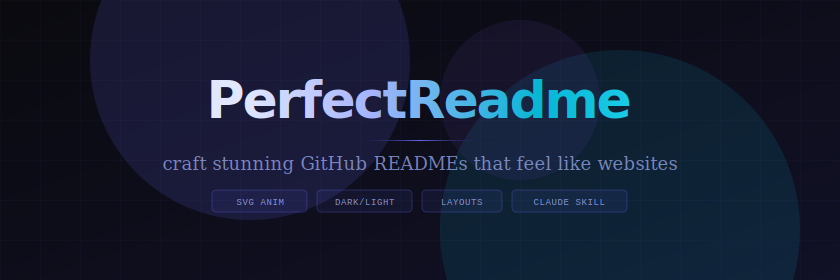
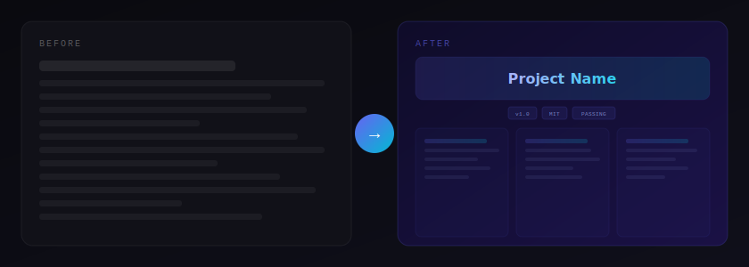
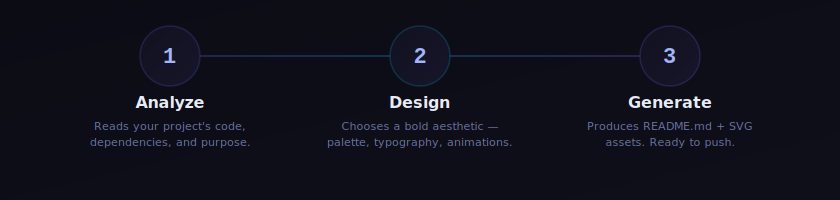
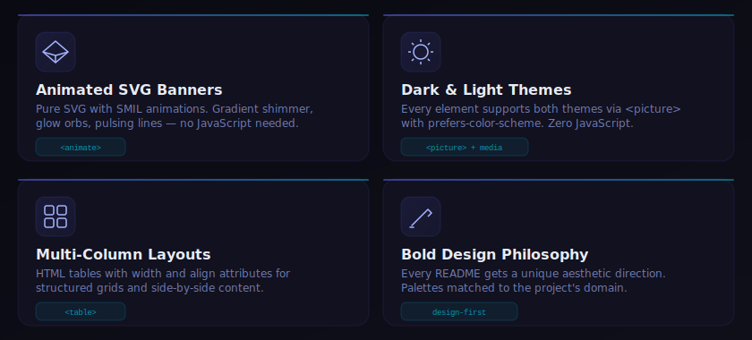
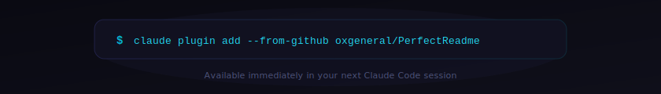

<picture>
  <source media="(prefers-color-scheme: dark)" srcset="./assets/banner-dark.svg">
  <source media="(prefers-color-scheme: light)" srcset="./assets/banner-light.svg">
  
</picture>

<p align="center">
  <strong>A Claude Code skill that transforms plain README files<br>into stunning, website-like experiences</strong>
</p>

<p align="center">
  <a href="#-how-it-works">How It Works</a>&nbsp;&nbsp;&bull;&nbsp;&nbsp;<a href="#-features">Features</a>&nbsp;&nbsp;&bull;&nbsp;&nbsp;<a href="#-install">Install</a>&nbsp;&nbsp;&bull;&nbsp;&nbsp;<a href="#-techniques">Techniques</a>&nbsp;&nbsp;&bull;&nbsp;&nbsp;<a href="#-examples">Examples</a>&nbsp;&nbsp;&bull;&nbsp;&nbsp;<a href="https://oxgeneral.github.io/PerfectReadme">Website</a>
</p>

<br>

<picture>
  <source media="(prefers-color-scheme: dark)" srcset="./assets/divider-dark.svg">
  <source media="(prefers-color-scheme: light)" srcset="./assets/divider-light.svg">
  
</picture>

<br>

## &nbsp;The Difference

<picture>
  <source media="(prefers-color-scheme: dark)" srcset="./assets/before-after.svg">
  <source media="(prefers-color-scheme: light)" srcset="./assets/before-after.svg">
  
</picture>

<br>

<picture>
  <source media="(prefers-color-scheme: dark)" srcset="./assets/divider-dark.svg">
  <source media="(prefers-color-scheme: light)" srcset="./assets/divider-light.svg">
  
</picture>

<br>

## &nbsp;How It Works

<picture>
  <source media="(prefers-color-scheme: dark)" srcset="./assets/steps-dark.svg">
  <source media="(prefers-color-scheme: light)" srcset="./assets/steps-light.svg">
  
</picture>

<br>

<picture>
  <source media="(prefers-color-scheme: dark)" srcset="./assets/divider-dark.svg">
  <source media="(prefers-color-scheme: light)" srcset="./assets/divider-light.svg">
  
</picture>

<br>

## &nbsp;Features

<picture>
  <source media="(prefers-color-scheme: dark)" srcset="./assets/features-dark.svg">
  <source media="(prefers-color-scheme: light)" srcset="./assets/features-light.svg">
  
</picture>

<br>

<picture>
  <source media="(prefers-color-scheme: dark)" srcset="./assets/divider-dark.svg">
  <source media="(prefers-color-scheme: light)" srcset="./assets/divider-light.svg">
  
</picture>

<br>

## &nbsp;Install

<picture>
  <source media="(prefers-color-scheme: dark)" srcset="./assets/install-dark.svg">
  <source media="(prefers-color-scheme: light)" srcset="./assets/install-light.svg">
  
</picture>

<details>
<summary><strong>Manual installation</strong></summary>

<br>

```bash
git clone https://github.com/oxgeneral/PerfectReadme.git
mkdir -p ~/.claude/skills/perfect-readme
cp PerfectReadme/skills/perfect-readme/SKILL.md ~/.claude/skills/perfect-readme/
```

</details>

<br>

<picture>
  <source media="(prefers-color-scheme: dark)" srcset="./assets/divider-dark.svg">
  <source media="(prefers-color-scheme: light)" srcset="./assets/divider-light.svg">
  
</picture>

<br>

## &nbsp;Techniques

The skill builds READMEs as **component-based landing pages** using SVG blocks assembled in markdown.

<table>
<tr>
<td width="50%" valign="top">

### Pure SVG + SMIL

Each section is a standalone `.svg` with native SVG elements and SMIL `<animate>` tags. Gradients, filters, patterns, animations — all survive GitHub's camo proxy. No `<foreignObject>`, no CSS, no JavaScript.

</td>
<td width="50%" valign="top">

### Dark / Light Themes

Every SVG component has a dark and light variant. The `<picture>` element with `prefers-color-scheme` media queries switches automatically based on the user's system theme.

</td>
</tr>
<tr>
<td width="50%" valign="top">

### Component Assembly

SVG files are visual building blocks — hero banners, feature grids, timelines, install cards, dividers. Markdown text and HTML tables provide structure between blocks.

</td>
<td width="50%" valign="top">

### Landing Page in README

The result is a README that looks and feels like a designed landing page — with visual hierarchy, color, motion, and polish — all within GitHub's rendering constraints.

</td>
</tr>
</table>

<br>

<picture>
  <source media="(prefers-color-scheme: dark)" srcset="./assets/divider-dark.svg">
  <source media="(prefers-color-scheme: light)" srcset="./assets/divider-light.svg">
  
</picture>

<br>

## &nbsp;Examples

<details open>
<summary><strong>Usage</strong></summary>

<br>

Once installed, just ask Claude Code:

```
Create a README for my project
```
```
/perfect-readme
```
```
Make a stunning GitHub profile README
```

The skill analyzes your project, chooses an aesthetic direction, generates SVG assets with dark/light variants, and assembles everything into a production-ready README.

</details>

<details>
<summary><strong>What GitHub allows &amp; strips</strong></summary>

<br>

**Allowed HTML:** `div`, `table`, `details`, `summary`, `picture`, `source`, `img`, `a`, `br`, `hr`, `kbd`, `sup`, `sub`, `code`, `pre`, `blockquote`, `p`, `span`, `h1`–`h6`, `ul`, `ol`, `li`, `dl`, `dt`, `dd`, `figure`, `figcaption`, `b`, `strong`, `i`, `em`, `del`, `ins`, `mark`, `small`

**Allowed attributes:** `href`, `src`, `alt`, `width`, `height`, `align`, `valign`, `colspan`, `rowspan`, `open`, `srcset`, `media`, `type`

**Stripped:** `style`, `class`, `id`, `<script>`, `<iframe>`, `<form>`, `<style>`, `<link>`, `<foreignObject>`, all event handlers, inline SVG

**SVG via `` — what survives:** native SVG elements, SMIL `<animate>`, `<linearGradient>`, `<pattern>`, `<filter>`, `<feGaussianBlur>`

**SVG via `` — what's stripped:** `<foreignObject>`, `<style>`, CSS `@keyframes`, `@import`, JavaScript, `:hover`

</details>

<details>
<summary><strong>Project structure</strong></summary>

<br>

```
PerfectReadme/
├── .claude-plugin/
│   └── plugin.json              # Plugin metadata
├── skills/
│   └── perfect-readme/
│       └── SKILL.md              # Skill definition
├── assets/
│   ├── banner-dark.svg           # Hero banner (dark)
│   ├── banner-light.svg          # Hero banner (light)
│   ├── features-dark.svg         # Feature cards (dark)
│   ├── features-light.svg        # Feature cards (light)
│   ├── steps-dark.svg            # Workflow timeline (dark)
│   ├── steps-light.svg           # Workflow timeline (light)
│   ├── install-dark.svg          # Install command (dark)
│   ├── install-light.svg         # Install command (light)
│   ├── before-after.svg          # Comparison visual
│   ├── divider-dark.svg          # Section divider (dark)
│   └── divider-light.svg         # Section divider (light)
├── index.html                    # Landing page (GitHub Pages)
├── LICENSE
└── README.md                     # ← You are here
```

</details>

<br>

<picture>
  <source media="(prefers-color-scheme: dark)" srcset="./assets/divider-dark.svg">
  <source media="(prefers-color-scheme: light)" srcset="./assets/divider-light.svg">
  
</picture>

<br>

<p align="center">
  <a href="https://oxgeneral.github.io/PerfectReadme"><strong>View Landing Page &rarr;</strong></a>
</p>

<p align="center">
  <sub>This README is a live demo — built entirely from SVG components assembled in markdown.<br>MIT &copy; 2026 Aleksandr Fefelov</sub>
</p>
